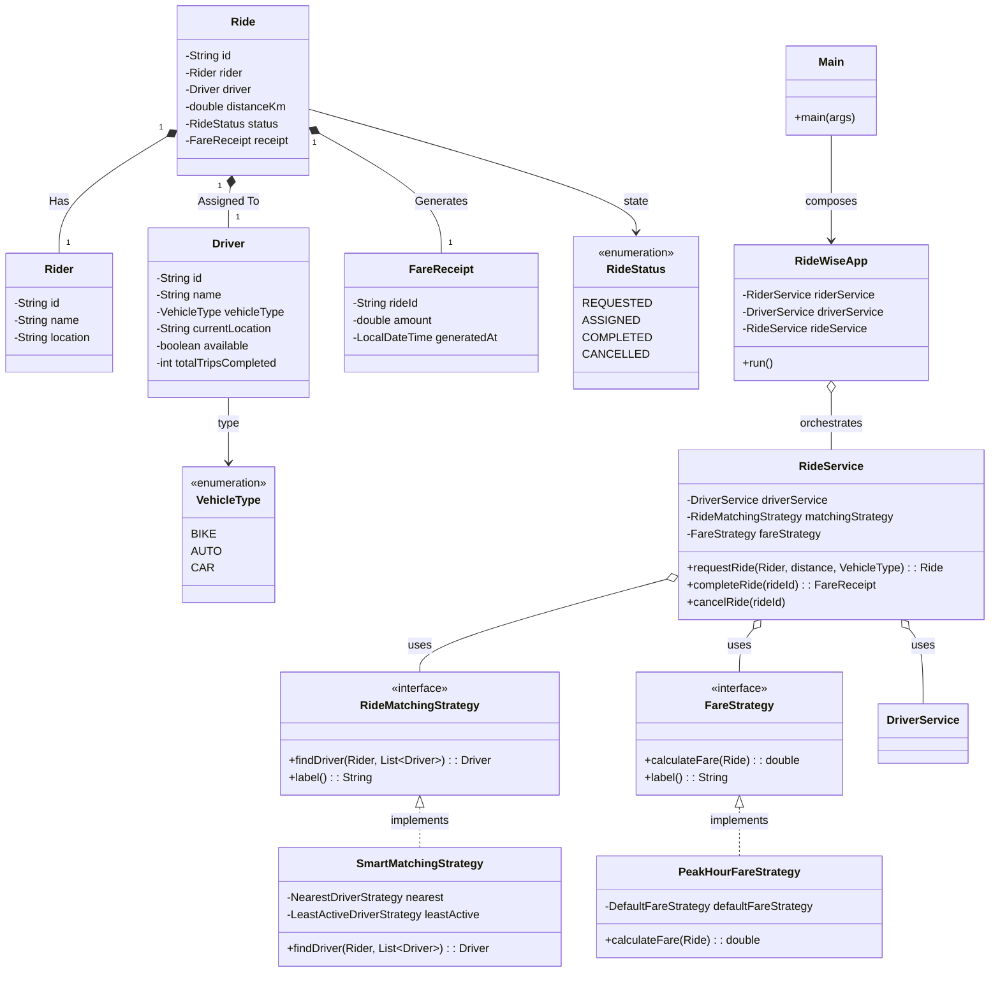

# Class Model

The following Mermaid diagram visualizes the structural relationships between the core entities, strategies, and services within the RideWise application.

## Key Architectural Notes
1. **Enums**: `VehicleType` prevents arbitrary string data for vehicles. `RideStatus` strictly limits ride lifecycle states.
2. **Strategy Interfaces**: Ensure `RideService` does not have hardcoded `if-else` loops for calculating pricing or matching drivers.
3. **Composites**: `SmartMatchingStrategy` and `PeakHourFareStrategy` visually demonstrate composition by internally holding references to the base strategies they wrap.
4. **Decoupling**: `Main` is the only class aware of the concrete strategy implementations (`SmartMatchingStrategy`, `PeakHourFareStrategy`). `RideWiseApp` is only aware of the Services.
